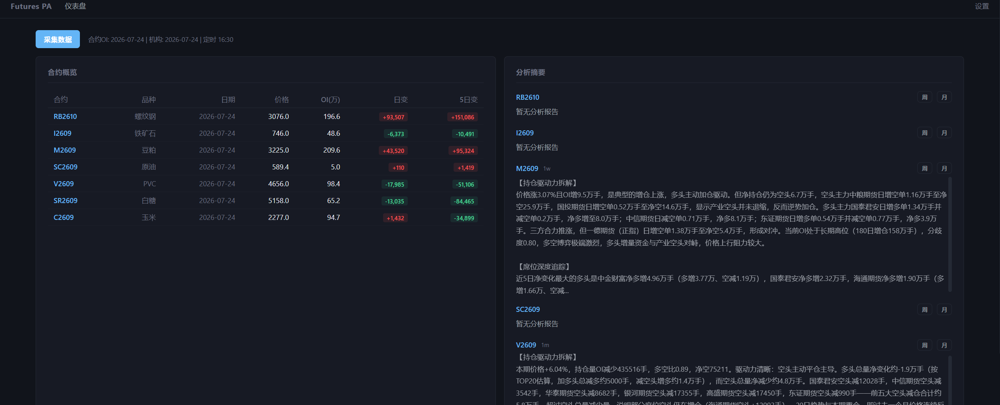
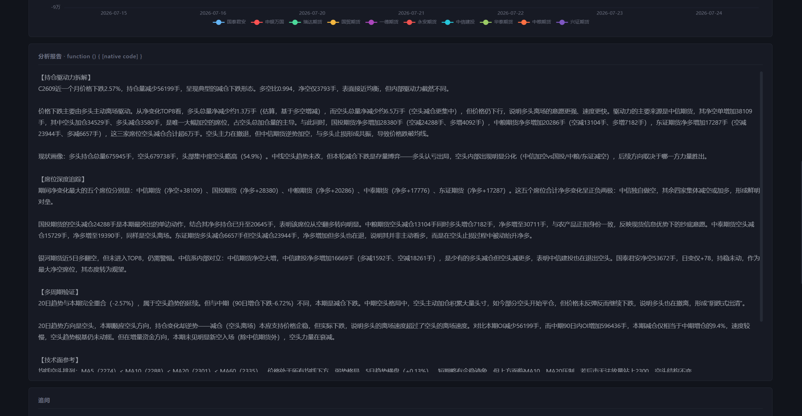

# 期货持仓分析系统

基于 AKShare + LLM 的期货持仓分析工具。自动采集合约 OI 和机构持仓数据，AI 智能研判主力动向。

## 截图




## 你需要准备

- **Python 3.10+**（[下载](https://www.python.org/downloads/)）
- **Node.js 18+**（[下载](https://nodejs.org/)）
- **Git**（[下载](https://git-scm.com/downloads)），或者直接从 GitHub 网页下载 ZIP

## 安装教程

### 第一步：下载项目

打开终端（Windows 按 `Win+R` 输入 `powershell`），找一个你放项目的目录：

```powershell
# 方式一：用 Git 克隆（推荐）
git clone https://github.com/wikikris/-AI-.git
cd -AI-

# 方式二：或者直接从 GitHub 网页点 Code → Download ZIP，解压后进入文件夹
```

### 第二步：安装 Python 依赖

```powershell
pip install -r backend/requirements.txt
```

### 第三步：安装前端依赖并构建

```powershell
cd frontend
npm install
npx vite build
cd ..
```

### 第四步：创建配置文件

```powershell
# Windows
copy config.example.yaml config.yaml

# Mac / Linux
cp config.example.yaml config.yaml
```

### 第五步：启动

```powershell
# Windows 直接双击 start.bat

# 或者终端运行：
python -m uvicorn backend.main:app --host 127.0.0.1 --port 8000
```

浏览器会自动打开 `http://localhost:8000`。如果没有自动打开，手动访问即可。

### 第六步：配置并开始使用

1. 点击顶部 **设置**，填写你的 AI API Key（支持 OpenAI / DeepSeek 等兼容接口）
2. 在 **关注合约** 区域添加你想跟踪的合约，如 `RB2610`、`I2609`
3. 保存后回到仪表盘，点击 **采集数据**
4. 数据采集完成后，点击合约代码进入详情页
5. 选择分析周期（周/月），点击 **分析** 按钮
6. 查看 AI 生成的持仓分析报告，可以继续追问

> 合约代码需要是当前活跃的主力合约，过期合约没有数据。

## 功能

- 追踪单合约 OI + 价格走势 + 量价关系
- 每日抓取会员多空持仓排名
- 正指/反指席位标注，席位转向预警
- 多周期持仓验证，趋势线检测
- AI 生成持仓驱动力分析、席位追踪、综合研判报告
- 分析后支持继续追问
- 每日 16:30 定时自动采集

## 技术栈

| 数据 | 后端 | 前端 | 定时 | AI |
|---|---|---|---|---|
| AKShare + Sina | FastAPI + SQLite | Vue3 + ECharts | APScheduler | OpenAI 兼容接口 |

## 常见问题

- 采集数据没反应：检查合约代码是否过期，换成当前活跃合约
- AI 分析没有内容：检查 API Key 是否正确填写
- 页面图表不显示：按 `Ctrl+Shift+R` 强制刷新浏览器
